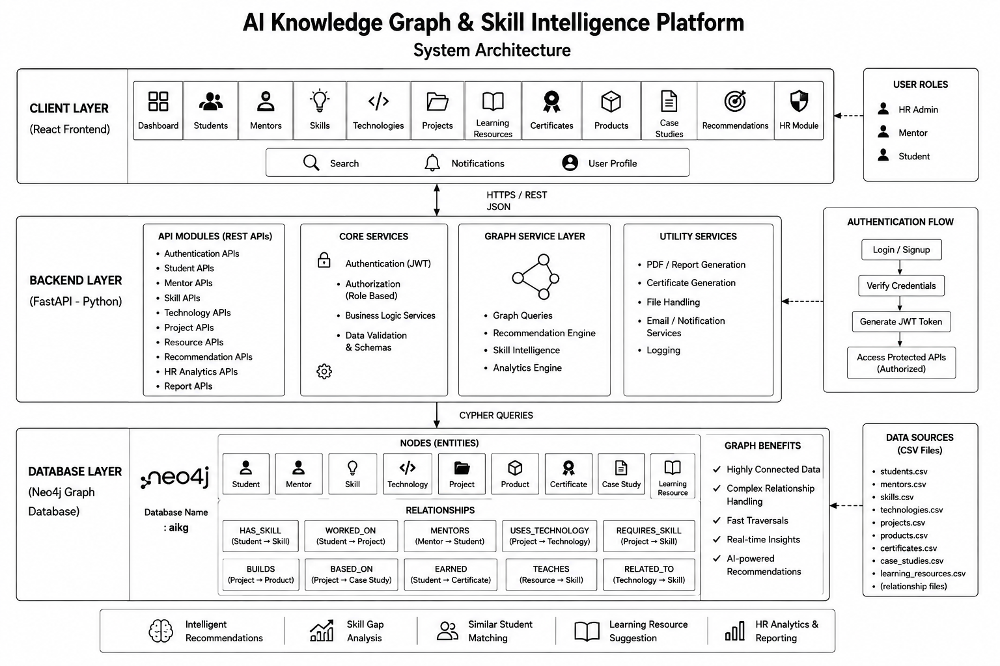

# AI Knowledge Graph & Skill Intelligence Platform

## Ezitech Internship Project

A full-stack **AI Knowledge Graph & Skill Intelligence Platform** designed to connect students, mentors, skills, technologies, projects, products, certificates, case studies, and learning resources in a centralized Neo4j Knowledge Graph.

The platform provides REST APIs through FastAPI and a modern React-based frontend for exploring ecosystem data, recommendations, analytics, and HR insights.

---

# Team Members

| Team Member | Role | Responsibilities |
|---|---|---|
| **Malaika Naz** | **Backend Developer & Knowledge Graph Developer** | Complete backend development using Python and FastAPI, Neo4j database and Knowledge Graph, Cypher queries, graph loading, REST APIs, authentication/JWT, recommendation APIs, and HR backend APIs. |
| **Saba Hayat** | **Frontend Developer & Documentation** | Complete React frontend, dashboard/UI, HR frontend, frontend API integration, dummy data generation using Google Colab, and project documentation. |

---

# 1. Project Overview

The **AI Knowledge Graph & Skill Intelligence Platform** converts disconnected educational and professional ecosystem data into a connected Knowledge Graph.

The system allows users and HR personnel to explore:

- Students
- Mentors
- Skills
- Technologies
- Projects
- Products
- Certificates
- Learning Resources
- Case Studies
- Recommendations
- HR Analytics
- HR Reports

The main purpose is to make relationships between these entities easier to discover and use for intelligent insights.

---

# 2. Problem Statement

The Ezitech ecosystem contains different types of information such as students, mentors, skills, technologies, projects, certificates, learning resources, products, and case studies.

When this information is stored as disconnected data, it creates several problems:

- Student skills and projects are difficult to analyze together.
- Relationships between students and mentors are difficult to explore.
- It is difficult to identify technologies used in projects.
- Students may not know which skills they should learn next.
- Suitable projects and learning resources are difficult to discover.
- HR cannot easily obtain centralized student and skill insights.
- Manual analysis of connected information takes time.
- Traditional tabular data does not naturally represent complex relationships.

---

# 3. Proposed Solution

We developed a **Knowledge Graph-based Skill Intelligence Platform** using Neo4j.

The proposed solution:

1. Stores ecosystem entities as graph nodes.
2. Stores connections between entities as graph relationships.
3. Uses Cypher queries to explore the graph.
4. Provides backend functionality through FastAPI REST APIs.
5. Provides a React frontend for users and HR.
6. Implements authentication and protected HR routes.
7. Provides recommendation functionality.
8. Provides HR analytics and reports.
9. Provides student profiles and connected information.
10. Makes complex relationships easier to visualize and analyze.

---

# 4. Project Architecture
The following architecture illustrates the overall structure of the
AI Knowledge Graph & Skill Intelligence Platform, including the
React frontend, FastAPI backend, Neo4j knowledge graph, authentication
layer, recommendation engine, and data flow.

<p align="center">
  
</p>

# 5. Technology Stack

## Backend

- Python
- FastAPI
- Uvicorn
- Pydantic
- JWT Authentication
- Password Hashing
- Cypher

## Database

- Neo4j
- Neo4j Knowledge Graph

## Frontend

- React
- Vite
- JavaScript
- Tailwind CSS
- Axios
- React Router
- Lucide React / React Icons

## Document Generation

- jsPDF
- html2canvas

## Data Generation / Preparation

- CSV
- Python
- Google Colab

---

# 6. Knowledge Graph
## Knowledge Graph Visualization

The Neo4j knowledge graph represents relationships between students,
skills, technologies, projects, mentors, certificates, resources,
and other entities.

<p align="center">
  
</p>

## Main Nodes

The graph contains the following major node types:

```text
Student
Mentor
Skill
Technology
Project
Product
Certificate
CaseStudy
LearningResource
```

## Main Relationships

| Relationship | Description |
|---|---|
| `HAS_SKILL` | Connects a student with their skills |
| `WORKED_ON` | Connects a student with projects |
| `MENTORS` | Connects mentors with students |
| `USES_TECHNOLOGY` | Connects projects with technologies |
| `REQUIRES_SKILL` | Connects projects with required skills |
| `BUILDS` | Connects relevant project/product entities |
| `BASED_ON` | Connects projects/case studies |
| `EARNED` | Connects students with certificates |
| `TEACHES` | Connects learning resources with skills |

---

# 7. Data Files

## Main Data

```text
students.csv
mentors.csv
skills.csv
technologies.csv
projects.csv
products.csv
certificates.csv
case_studies.csv
learning_resources.csv
```

## Relationship Data

```text
student_skills.csv
student_projects.csv
mentor_students.csv
project_technologies.csv
technology_skills.csv
project_products.csv
project_case_studies.csv
student_certificates.csv
learning_resource_skills.csv
```

---

# 8. Platform Modules

## 8.1 Dashboard

The main dashboard provides an overview of the platform using KPI/statistical cards.

It includes information related to:

- Students
- Mentors
- Skills
- Technologies
- Projects
- Certificates
- Learning Resources
- Products
- Case Studies

Dashboard cards are also connected to their relevant modules for navigation.

---

## 8.2 Students

The Students module provides:

- Student listing
- Student search
- Student information
- Student skills
- Student projects
- Student certificates
- Student profiles

---

## 8.3 Mentors

The Mentors module provides:

- Mentor listing
- Mentor information
- Mentor-student relationships
- Mentor profile information

---

## 8.4 Skills

The Skills module provides information about available skills and their relationships with students, technologies, projects, and resources.

---

## 8.5 Technologies

The Technologies module provides technology information and its connections with projects and skills.

---

## 8.6 Projects

The Projects module provides:

- Project listing
- Project details
- Technologies used
- Required skills
- Related information

---

## 8.7 Products

The Products module provides information about products and their graph relationships.

---

## 8.8 Certificates

The Certificates module provides certificate information connected with students.

Student-related certificate documents can also be generated through the frontend.

---

## 8.9 Learning Resources

Learning resources are connected with skills and can be used to help students improve their skill gaps.

---

## 8.10 Case Studies

The Case Studies module provides case-study information and relevant project relationships.

---

## 8.11 Recommendations

The recommendation module provides graph-based recommendations including:

- Recommended skills
- Recommended projects
- Recommended mentors
- Learning resources
- Similar students

The recommendation system uses relationships available in the Knowledge Graph to generate relevant connected information.

---

# 9. HR Module

A dedicated HR section was developed for administrative and analytical use.

## HR Dashboard

Provides:

- KPI cards
- Student overview
- Mentor overview
- Skill information
- Technology information
- Platform statistics

KPI cards are clickable and navigate to the relevant HR modules.

## HR Students

Provides:

- Complete student list
- Search
- Student profile access
- Student skills
- Student projects
- Student certificates

## HR Mentors

Provides:

- Mentor list
- Mentor information
- Mentor-student relationships

## HR Analytics

Provides graph-based insights such as:

- Top skills
- Top technologies

## HR Reports

Provides:

- Dashboard summary
- Top skills
- Top technologies
- Recent students
- Recent projects

---

# 10. Authentication

The platform includes authentication functionality.

## Signup

HR users can create an account through the signup interface.

The password is hashed before storage.

## Login

The login process:

```text
User enters email/password
          ↓
FastAPI Login API
          ↓
Find user in Neo4j
          ↓
Verify password
          ↓
Generate JWT token
          ↓
Return user + token
          ↓
Store token in frontend
          ↓
Open authorized dashboard
```

## JWT Authorization

Protected HR endpoints require a valid Bearer token.

The backend verifies:

- Token validity
- Email
- User role

HR routes require the `HR` role.

---

# 11. Important API Routes

## Authentication

```text
POST /auth/signup
POST /auth/login
```

## HR

```text
GET /hr/profile
GET /hr/dashboard
GET /hr/students
GET /hr/students/{student_id}
GET /hr/mentors
GET /hr/mentors/{mentor_id}
GET /hr/analytics
GET /hr/recommendations/{student_id}
GET /hr/reports
```

## Recommendations

```text
GET /recommendations/...
```

Other platform APIs are organized according to their corresponding modules.

---

# 12. FastAPI Swagger Documentation

After starting the backend, API documentation can be opened at:

```text
http://127.0.0.1:8000/docs
```

Swagger allows APIs to be:

- Viewed
- Tested
- Verified
- Checked with request parameters
- Checked with authentication

---

# 13. Important Neo4j Queries

## 13.1 Show Complete Graph

```cypher
MATCH (n)-[r]->(m)
RETURN n, r, m
LIMIT 200;
```

This query displays nodes and their relationships.

---

## 13.2 Count Node Types

```cypher
MATCH (n)
RETURN labels(n) AS NodeType, count(n) AS Count
ORDER BY Count DESC;
```

This query shows how many nodes exist for each entity type.

---

## 13.3 Count Relationships

```cypher
MATCH ()-[r]->()
RETURN type(r) AS Relationship, count(r) AS Count
ORDER BY Count DESC;
```

This query shows the number of relationships for each relationship type.

---

## 13.4 Students and Skills

```cypher
MATCH (s:Student)-[:HAS_SKILL]->(sk:Skill)
RETURN s, sk
LIMIT 100;
```

---

## 13.5 Students and Projects

```cypher
MATCH (s:Student)-[:WORKED_ON]->(p:Project)
RETURN s, p
LIMIT 100;
```

---

## 13.6 Projects and Technologies

```cypher
MATCH (p:Project)-[:USES_TECHNOLOGY]->(t:Technology)
RETURN p, t
LIMIT 100;
```

---

## 13.7 Mentor-Student Relationships

```cypher
MATCH (m:Mentor)-[:MENTORS]->(s:Student)
RETURN m, s
LIMIT 100;
```

---

## 13.8 Student Certificates

```cypher
MATCH (s:Student)-[:EARNED]->(c:Certificate)
RETURN s, c
LIMIT 100;
```

---

## 13.9 Learning Resources and Skills

```cypher
MATCH (r:LearningResource)-[:TEACHES]->(s:Skill)
RETURN r, s
LIMIT 100;
```

---

## 13.10 Student Skill Lookup

```cypher
MATCH (s:Student {student_id: "STU001"})-[:HAS_SKILL]->(skill:Skill)
RETURN s.name AS Student,
       collect(skill.name) AS Skills;
```

---

## 13.11 Similar Students

```cypher
MATCH (s:Student {student_id: "STU001"})-[:HAS_SKILL]->(skill:Skill)
MATCH (other:Student)-[:HAS_SKILL]->(skill)
WHERE other <> s
RETURN other.name AS SimilarStudent,
       count(skill) AS CommonSkills
ORDER BY CommonSkills DESC;
```

---

# 14. Recommendation Flow

```text
                    Student
                       │
              ┌────────┼────────┐
              │        │        │
              ▼        ▼        ▼
          HAS_SKILL  WORKED_ON  EARNED
              │        │        │
              ▼        ▼        ▼
            Skills   Projects Certificates
                       │
                       ▼
                 Technologies
                       │
                       ▼
               Knowledge Graph
                       │
                       ▼
              Recommendation Logic
                       │
        ┌──────────────┼──────────────┐
        ▼              ▼              ▼
      Skills        Resources      Similar Students
        │
        └──────────────┬─────────────┘
                       ▼
                 Frontend Results
```

---

# 15. Frontend Structure

```text
frontend/
└── src/
    ├── components/
    │   ├── common/
    │   ├── dashboard/
    │   ├── HR/
    │   └── layout/
    │
    ├── context/
    │   └── AuthContext.jsx
    │
    ├── pages/
    │   ├── Dashboard.jsx
    │   ├── Students.jsx
    │   ├── Mentors.jsx
    │   ├── Skills.jsx
    │   ├── Technologies.jsx
    │   ├── Projects.jsx
    │   ├── LearningResources.jsx
    │   ├── Certificates.jsx
    │   ├── Products.jsx
    │   ├── CaseStudies.jsx
    │   ├── Recommendations.jsx
    │   └── HR/
    │       ├── HRDashboard.jsx
    │       ├── HRStudents.jsx
    │       ├── HRStudentProfile.jsx
    │       ├── HRMentors.jsx
    │       ├── HRAnalytics.jsx
    │       └── HRReports.jsx
    │
    ├── services/
    │   ├── authApi.js
    │   └── hrApi.js
    │
    ├── App.jsx
    └── main.jsx
```

---

# 16. Backend Structure

```text
backend/
└── app/
    ├── api/
    │   └── v1/
    │
    ├── auth/
    │   ├── dependencies.py
    │   ├── jwt.py
    │   └── password.py
    │
    ├── graph/
    │   ├── neo4j_driver.py
    │   ├── graph_schema.py
    │   ├── graph_loader.py
    │   ├── graph_queries.py
    │   ├── auth_queries.py
    │   └── recommendation_queries.py
    │
    ├── schemas/
    │   └── auth_schema.py
    │
    └── main.py
```

---

# 17. Major Backend Responsibilities

The backend was developed using Python and FastAPI.

Major backend responsibilities include:

- FastAPI application setup
- API routing
- Neo4j connection
- Graph schema
- Graph data loading
- Cypher queries
- Student APIs
- Mentor APIs
- Skill APIs
- Technology APIs
- Project APIs
- Recommendation queries
- Authentication
- Password hashing
- JWT generation
- JWT validation
- HR authorization
- HR dashboard APIs
- HR analytics APIs
- HR reports APIs

---

# 18. Frontend Responsibilities

The frontend was developed using React and Vite.

Major frontend responsibilities include:

- Application layout
- Sidebar navigation
- Navbar
- Dashboard UI
- KPI cards
- Data tables/cards
- Search functionality
- Notifications
- Authentication screens
- Protected routes
- Student profiles
- Mentor pages
- Project pages
- Recommendation interface
- HR dashboard
- HR students
- HR mentors
- HR analytics
- HR reports
- API integration
- PDF/document generation

---

# 19. Project Challenges and Solutions

## Backend Challenges

### Challenge 1 — Connecting the application with Neo4j

The project required a reliable connection between FastAPI and Neo4j.

**Solution:**  
A dedicated Neo4j connection/driver structure was implemented and graph queries were separated into reusable query modules.

---

### Challenge 2 — Loading interconnected CSV data

Multiple entity CSV files and relationship CSV files had to be converted into a connected graph.

**Solution:**  
A graph loader was developed to create nodes and relationships according to the defined graph schema.

---

### Challenge 3 — Complex graph queries

Finding relationships such as student skills, projects, technologies, mentors, resources, and similar students required Cypher queries.

**Solution:**  
Reusable graph query functions were created in the graph query modules.

---

### Challenge 4 — Recommendation results

Some initial recommendation queries returned empty or incomplete results.

**Solution:**  
Graph relationships and query logic were checked and recommendation queries were refined to use the available Knowledge Graph connections.

---

### Challenge 5 — Authentication and protected HR APIs

HR data needed to be protected from unauthorized access.

**Solution:**  
JWT authentication, password hashing, Bearer authentication, and an HR role dependency were implemented.

---

## Frontend Challenges

### Challenge 1 — API integration

Frontend modules needed to correctly consume FastAPI responses.

**Solution:**  
Axios service files were created and API calls were connected to React components.

---

### Challenge 2 — Protected routes

Unauthorized users should not be able to directly access HR pages.

**Solution:**  
A `ProtectedRoute` component and authentication context were implemented.

---

### Challenge 3 — API response structure differences

Some API responses contained objects such as:

```text
{
    total_students: ...,
    students: [...]
}
```

while frontend components expected arrays.

**Solution:**  
Frontend data handling was adjusted according to the actual API response structure.

---

### Challenge 4 — Routing and navigation

HR pages and main platform pages needed separate navigation paths.

**Solution:**  
React Router routes were organized for the main platform and HR module.

---

### Challenge 5 — UI component errors

Import/export and component rendering issues occurred during development.

**Solution:**  
Component imports, exports, route configuration, and reusable UI components were reviewed and corrected.

---

### Challenge 6 — Search and notification functionality

The Navbar required functional search and notification interactions.

**Solution:**  
Search filtering, navigation, notification dropdown state, and logout functionality were implemented.

---

### Challenge 7 — PDF/document generation

The requirement was to generate clean student-related documents rather than simply printing the screen.

**Solution:**  
PDF generation functionality was added using `jsPDF` and supporting frontend document-generation tools.

---

# 20. Testing

The project was tested through:

- FastAPI Swagger
- Authentication
- Signup
- Login
- JWT token storage
- Protected routes
- Logout
- Neo4j queries
- Dashboard APIs
- Student APIs
- Mentor APIs
- Recommendation APIs
- HR APIs
- Frontend navigation
- Search
- Notifications
- Student profiles
- HR student profiles
- Analytics
- Reports
- PDF generation
- Production frontend build

---

# 21. Production Build

The frontend was successfully tested with:

```bash
npm run build
```

A successful build generates the production files inside:

```text
frontend/dist/
```

---

# 22. Installation and Setup

## Step 1 — Clone Repository

```bash
git clone <YOUR_GITHUB_REPOSITORY_URL>
cd "AI Knowledge Graph and Skill Intelligence Platform"
```

---

## Step 2 — Create Python Environment

Windows PowerShell:

```powershell
python -m venv .venv
.\\.venv\\Scripts\\Activate.ps1
```

---

## Step 3 — Install Backend Dependencies

```bash
pip install -r requirements.txt
```

---

## Step 4 — Configure Neo4j

Create/start a Neo4j database and configure the environment variables.

Example:

```env
NEO4J_URI=your_neo4j_uri
NEO4J_USERNAME=your_neo4j_username
NEO4J_PASSWORD=your_neo4j_password
NEO4J_DATABASE=aikg
```

**Do not upload the real `.env` file to GitHub.**

---

## Step 5 — Run Backend

From the project root:

```bash
uvicorn backend.app.main:app --reload
```

Backend:

```text
http://127.0.0.1:8000
```

Swagger:

```text
http://127.0.0.1:8000/docs
```

---

## Step 6 — Run Frontend

```bash
cd frontend
npm install
npm run dev
```

Frontend normally runs at:

```text
http://localhost:5173
```

---

# 23. Environment and GitHub Security

The following files/folders should not be committed:

```text
.env
.venv/
node_modules/
frontend/dist/
__pycache__/
*.pyc
```

Recommended `.gitignore`:

```gitignore
.env
.venv/
__pycache__/
*.pyc
node_modules/
frontend/dist/
```

The repository should contain:

```text
.env.example
```

instead of real credentials.

---

# 24. GitHub Collaboration

The repository can be shared with team members through GitHub.

If a collaborator is added to the repository, they can clone/pull the project and work with the same source code.

Example:

```bash
git clone <YOUR_GITHUB_REPOSITORY_URL>
```

For local execution, each developer must configure their own environment and Neo4j credentials.

---

# 25. Local vs Live Deployment

GitHub stores the project source code but does not automatically run the local FastAPI and Neo4j services.

## Local Architecture

```text
Browser
   ↓
React / Vite
   ↓
FastAPI
   ↓
Neo4j
```

## Public Deployment Architecture

```text
Browser
   ↓
Hosted React Frontend
   ↓
Hosted FastAPI Backend
   ↓
Hosted Neo4j Database
```

For a public live dashboard, the frontend API URL must point to the deployed backend instead of:

```text
http://127.0.0.1:8000
```

---

# 26. Project Status

The major project modules have been completed:

- ✅ React Frontend
- ✅ FastAPI Backend
- ✅ Neo4j Database
- ✅ Knowledge Graph
- ✅ Graph Loader
- ✅ Graph Queries
- ✅ REST APIs
- ✅ Authentication
- ✅ JWT Authorization
- ✅ Main Dashboard
- ✅ Students
- ✅ Mentors
- ✅ Skills
- ✅ Technologies
- ✅ Projects
- ✅ Products
- ✅ Certificates
- ✅ Learning Resources
- ✅ Case Studies
- ✅ Recommendations
- ✅ HR Dashboard
- ✅ HR Students
- ✅ HR Student Profiles
- ✅ HR Mentors
- ✅ HR Analytics
- ✅ HR Reports
- ✅ Frontend/Backend Integration
- ✅ Protected HR Routes
- ✅ Search
- ✅ Notifications
- ✅ Logout
- ✅ PDF/document generation
- ✅ Production build

---

# 27. Project Outcome

The final system provides a connected and interactive platform for managing and analyzing the Ezitech ecosystem.

Instead of treating students, skills, projects, mentors, technologies, certificates, and learning resources as isolated records, the Knowledge Graph connects them and enables relationship-based analysis.

The platform demonstrates the practical integration of:

```text
Python
      +
FastAPI
      +
Neo4j
      +
Cypher
      +
Knowledge Graph
      +
React
      +
REST APIs
      +
JWT Authentication
      +
Recommendation Logic
      +
HR Analytics
```

---

# 28. Future Improvements

Possible future enhancements include:

- AI/LLM-powered natural language graph search
- Advanced recommendation scoring
- Automated skill-gap analysis
- Resume-to-Knowledge-Graph matching
- Real-time analytics
- Advanced HR dashboards
- Role-based access beyond HR
- Cloud deployment
- Automated graph updates
- More advanced visualization of graph relationships

---
## Complete Documentation

The complete project documentation is available here:
docs/Project_Documentation.pdf

# 29. Acknowledgement

This project was developed as part of the **Ezitech internship/case-study work**.

The project demonstrates how a Knowledge Graph can be combined with a modern web application to provide connected data exploration, recommendations, skill intelligence, and HR insights.

---

# AI Knowledge Graph & Skill Intelligence Platform

### Python • FastAPI • Neo4j • Cypher • React • Vite • Tailwind CSS • REST APIs

**Team:** Malaika Naz & Saba Hayat

